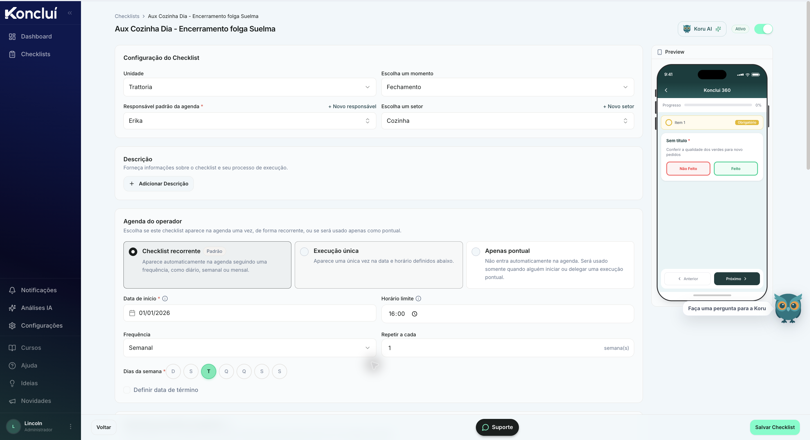
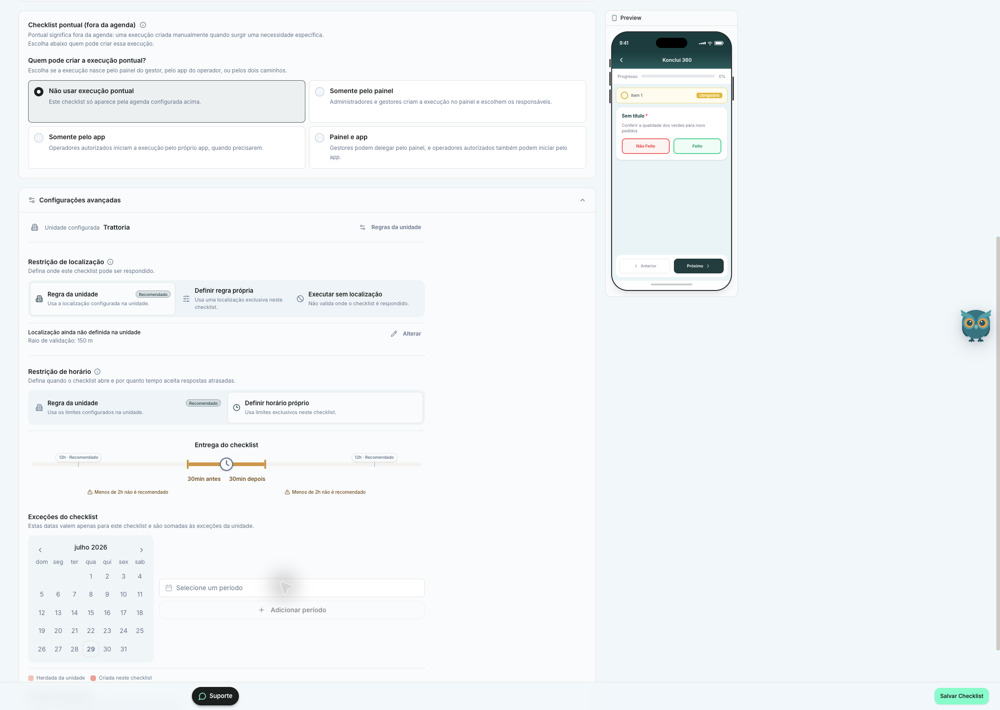
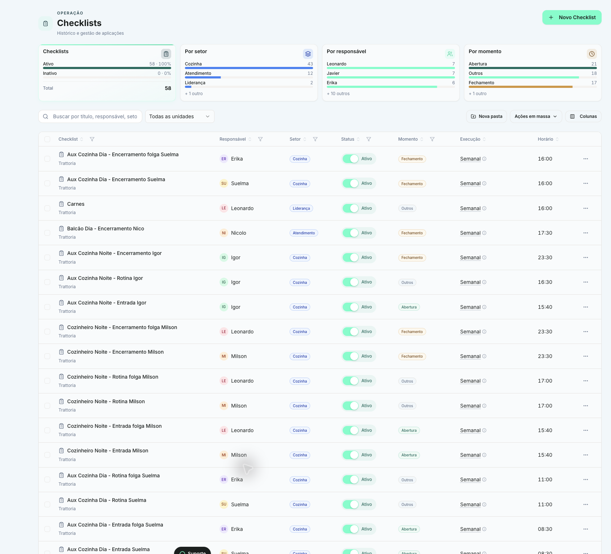
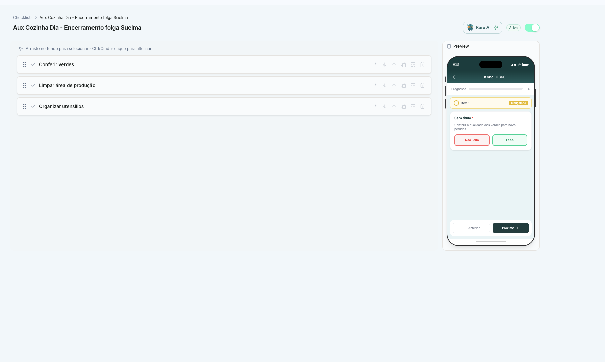
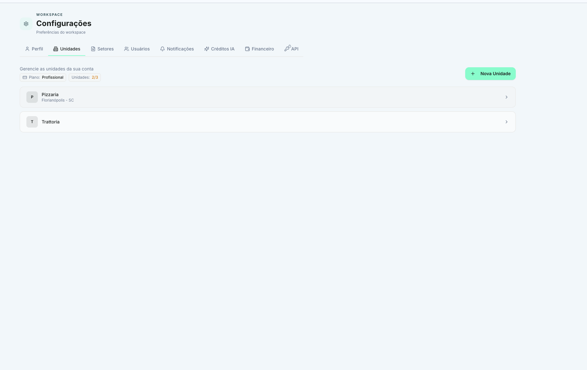

# Referências Koncluí de 2026-07-29

Fonte: capturas fornecidas pelo usuário a partir de uma sessão autorizada do
Portal do Gestor. O Koncluí não foi alterado.

## Inventário

### 01. Configuração, agenda e preview

Comprova visualmente:

- vínculo com unidade, momento, responsável padrão e setor;
- descrição opcional do checklist;
- três modos de agenda: recorrente, execução única e apenas pontual;
- data de início, horário limite, frequência, intervalo, dias da semana e data
  de término;
- preview móvel guiado com progresso, item obrigatório, ações `Não feito` e
  `Feito`, além de navegação anterior/próximo.

### 02. Execução pontual e restrições avançadas

Comprova visualmente:

- autorização de execução pontual: desativada, somente painel, somente app ou
  painel e app;
- restrição de localização herdada da unidade, regra própria ou execução sem
  localização;
- raio de validação configurável;
- restrição de horário herdada ou própria;
- janela de entrega antes e depois do horário;
- períodos adicionais de execução no calendário.

### 03. Biblioteca e gestão de checklists

Comprova visualmente:

- indicadores de ativos/inativos e distribuições por setor, responsável e
  momento;
- busca, filtro por unidade, pastas, ações em massa e seleção de colunas;
- linhas com checklist, unidade, responsável, setor, status, momento,
  frequência e horário;
- ativação direta e menu contextual por checklist.

### 04. Construtor de itens e execução guiada

Comprova visualmente:

- ordenação por arrastar e controles de reordenação;
- item obrigatório, duplicação, configuração e exclusão por linha;
- preview de execução por etapas, com progresso, destaque do item atual e
  navegação anterior/próximo;
- resposta binária explícita por `Não feito` ou `Feito`.

### 05. Configurações e unidades

Comprova visualmente:

- áreas de perfil, unidades, setores, usuários, notificações, créditos de IA,
  financeiro e API;
- limite de unidades associado ao plano;
- criação e abertura individual de unidades.

## Consequências para a paridade

Estas capturas acrescentam requisitos concretos à matriz do Ritmika:

1. modelar recorrência, execução única e execução pontual como contratos
   distintos;
2. permitir origem da execução pontual por painel, app ou ambos;
3. representar restrições de localização e horário sem reduzi-las a campos de
   texto;
4. preservar janela de entrega e exceções por período;
5. manter preview operacional sincronizado com o construtor;
6. oferecer indicadores e filtros na biblioteca de checklists;
7. manter gestão de unidades, setores, usuários e políticas como estruturas
   genéricas de workspace.

## Limite da evidência

As imagens mostram o Portal do Gestor e o preview embutido do aplicativo. Elas
não certificam câmera, GPS real, push, offline, biometria, vídeo, assinatura,
sincronização nativa nem todas as telas do aplicativo operacional.
